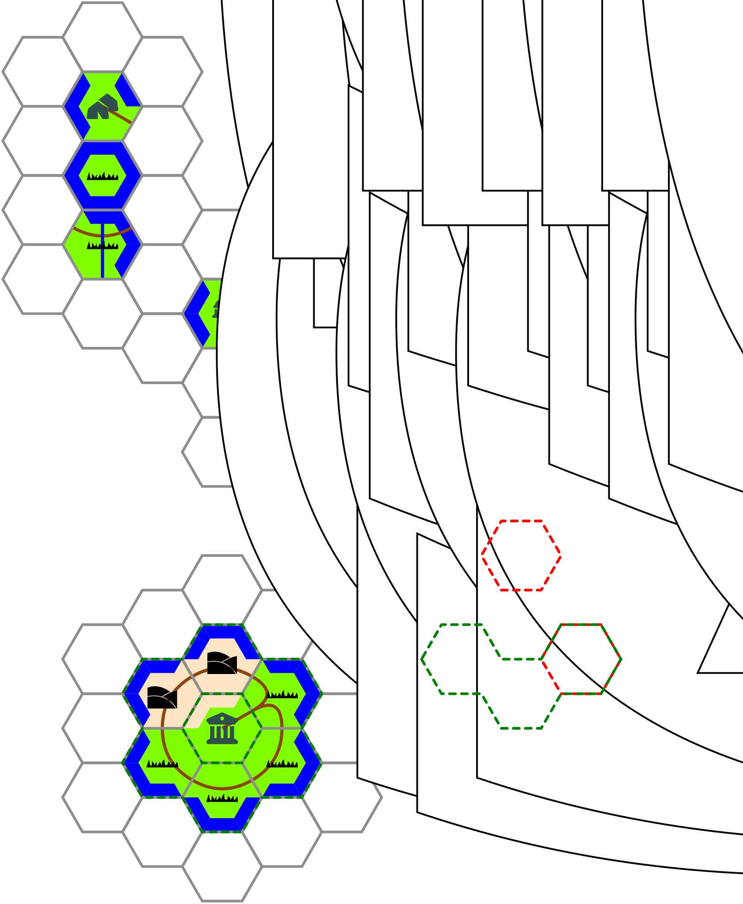

# hex-chronicle
An hex-map generator for exploration sand-box RPG 

- [hex-chronicle](#hex-chronicle)
  - [Python version](#python-version)
  - [Requirements](#requirements)
  - [Example of the generated map](#example-of-the-generated-map)
  - [Usage](#usage)
  - [Hexagon description example](#hexagon-description-example)
    - [Terrain types](#terrain-types)
    - [Multiple parts terrain.](#multiple-parts-terrain)
    - [Roads and River](#roads-and-river)
    - [Buildings icons](#buildings-icons)
  - [The Hexagon concept](#the-hexagon-concept)
    - [Zone composition](#zone-composition)
    - [Polygon composition](#polygon-composition)
  - [TODOs](#todos)
    - [Next](#next)
  - [Thanks](#thanks)

## Python version

Python 3.8.10

## Requirements

```sh
pip install python-frontmatter
```

## Example of the generated map

This is the map generated by files in [test_files](test_files/) directory.


## Usage

```sh
python hexamap.py [--output <file or repository>] [--css <custom css file>] <files or repositories, allows glob pattern>
```

The script will fetch all files and repository passed as parameters. For each file with a filename formatted like `XXYY-somedescription.md` it will create a hexammap with enough hexagon to contains those defined from the XX,YY coordinate in the filenames.

Moreover, it will retrieve frontmatter metadata to add some features to the terrain polygon.

## Hexagon description example

Here is an example of how to define an hexagon. Everything which is not defined will be simply ignored.

```md
---
terrain:
    type: heavy_wood # can be any value in defined in css (each terrain is defined by a CSS class)
    mixed:
        - type: lake
          sides:
            - C
        - type: marsh
          sides:
            - SO
alt: Some Text # this text will be printed in the hex if there is no icon. It should be short.
icon: fortin # An icon will be placed on the hexagon. No alt text will be added
roads: 
    - SO SE # To draw some roads on the polygon, from a side to another, or from the center to a side
rivers: 
    - N S # To draw some rivers on the polygon, from a side to another, or from the center to a side
---

# The content doesn't matter now

We only get metadata to draw the map. But the content maybe useful for something else (I don't know, a Hugo website which will host the generate map, for instance ? ;) ) 
```

Moreover, you can check the [Test files](test_files/) to have more example.


### Terrain types

Current supported terrain type are:

- plains
- light_wood
- heavy_woods
- grassland
- mountains
- hills
- sea
- lake
- marsh
- desert
- unknown

Terrains can be added / modified by using the custom CSS feature through the `--css` command line argument

### Multiple parts terrain.

You can have different type of terrain on a same Hexagone. There is seven zones in a hexagon. See [The Hexagon concept](#the-hexagon-concept) paragraph.

### Roads and River

Roads and rivers can start or end from the middle of a side of the hexagon, or from the center. To identify such point, use the appropriate zone. See [The Hexagon concept](#the-hexagon-concept) paragraph.

### Buildings icons

Below icons are available.

| Icon                                                           | Code         |
| -------------------------------------------------------------- | ------------ |
|          | capitale     |
|        | cavaliers    |
|  | chevaucheurs |
|                  | fort         |
|              | fortin       |
|                | mages        |
|                | nains        |
|  | observatoire |
|                  | pont         |
|            | portail      |
|              | ruines       |
|              | sidhes       |
|              | temple       |
|            | village      |
|          | capitale     |
|        | cavaliers    |
|  | chevaucheurs |
|                  | fort         |
|              | fortin       |
|                | mages        |
|                | nains        |
|  | observatoire |
|                  | pont         |
|            | portail      |
|              | ruines       |
|              | sidhes       |
|              | temple       |
|            | village      |


## The Hexagon concept

```ascii
                                                                              N
       point NO--> o----------o <-- point NE                           NO     |     NE          
                  / \    N   / \                                         \    |    /
                 /   o------o   \                                         \   |   /
                / NO/        \ NE\                                         \  |  /
               /   /          \   \                                         \ | /          
   point O--> <o---o  Zone C   o---o <-- point E    ^             O --------- C --------- E
               \   \          /   /                 |                       / | \ 
                \ SO\        / SE/                  | radius2              /  |  \    
                 \   o------o   /                   |                     /   |   \   
                  \ /    S   \ /                    |                    /    |    \  
       point SO--> o----------o <-- point SE        v                  SO     |     SE
                                                                              S
                         <-radius->                       

```

For each hexagon, we can define several points, and zone that can be defined trough their cardinal point (N, E, S, O, NE, SE, NO, SE) and their type (external point, internal point, zone). The center is a specific zone.

It will be used to make easier to draw grid, and coast hexagon where the whole surface of the hexagon is not covered by the same terrain type.

### Zone composition

It is possible to define compound zone, which can also be unambiguously specified with a cardinal point and a number of "atomic" zone:

* `N{3}` is the composition of atomic zone N, NO, NE* 
* `N{2}` doesn't exists since it would be ambiguous between (N, NO) and (N, NE) (same as any `N{2k}`)
* `N{5}` is the composition of atomic zone N, NO, NE, SO, SE
* `O{2}` would be the composition of NO and SO.


With this concept, we can easily compute different subparts of the hexagon and create SVG layer to hide some of them.

### Polygon composition

Each zone can be computed as a polygon of 4 points (2 of the inner hexagon, 2 of the outer). Computing a valid compound zone polygon requires to put all those points in a set, then sort the sequence like that: Outer circle point in trigonometric order (E < NE < NO < O < SO < SE < E, points must be consecutive), inner circle point in reverse-trigonometric order (E < SE < SO < O < NO < NE < E)

## TODOs

### Next

- Grid optimization: Base polygon should be drawed as defs and duplicated
  - cf [http://thenewcode.com/1102/Cloning-SVG-Elements-Using-use]
- Hex icon from terrain
- securization (markers at borders and number color or font)
- hex terrain optimization : 
  - Draw only one polygon for contiguous mixed sides (hex we sea coast). It will allow to have coastline in futur
- Fix : Negative row column for hex
- Allow custom icons 


## Thanks
 
 Thanks to <https://github.com/toonvandeputte/hexmaker> which give me the base of the algorithm even if it has been quite modified and upgraded. I would'nt have the motivation without this code.
